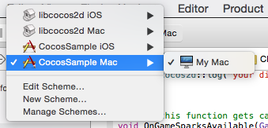

# Quick Start Guide for Cocos2d-x

## Prerequisites

### OS X

1. [XCode](https://developer.apple.com/xcode/downloads/)

### Windows

1. [download](https://www.python.org/downloads/) and install python 2.7 (only required on windows)
2. [Visual Studio](http://www.visualstudio.com/downloads/download-visual-studio-vs.aspx)

## Compile the base SDK

Please follow the instructions in the section "Compile the SDK" of the [Quick Start Guide for the base SDK](@ref QuickStartGuideForTheBaseSDK)

## prepare dependencies

	run install_dependencies.py

This will download cocos2dx, extract it, copy it to the right location and download additional dependencies of cocos2d-x

## Compile and run the sample

### OS X

1. Open Sample/proj.ios_mac/CocosSample.xcodeproj in XCode
2. insert your API credentials retrieved from [The GameSparks Portal](http://portal.gamesparks.net/) into AppDelegate.cpp

		...
		struct GameSparksCocos
		{
		    GameSparksCocos()
		    :platform("<insert-your-api-key-here>", "<insert-your-api-secret-here>", true, true)
		    {
		        GS.Initialise(&platform);
		    }
		...
3. select CocosSample Mac/My Mac from the Scheme drop down menu in XCode

	

4. press cmd+r to compile and run the sample

### Windows

1. Open Sample\proj.win32\CocosSample.sln in Visual Studio
2. right click CocosSample in the Solution Explorer and select "Set as StartUp Project"
3. press F5 to compile and run the sample

## Next Steps

explore the [API docs](./annotated.html) and the [Examples](./examples.html) of the base SDK.
