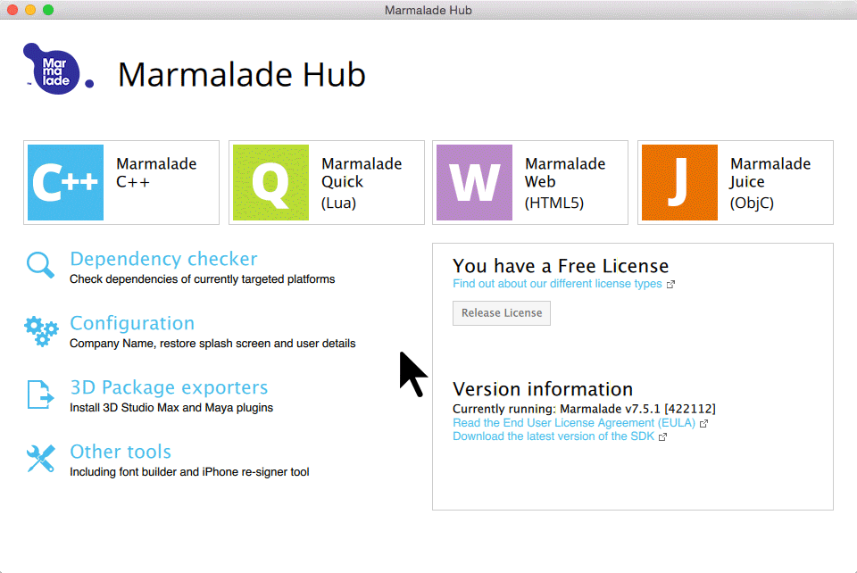

# Quick Start Guide for Marmalade

## Prerequisites

### OS X

1. [download](https://www.madewithmarmalade.com/) and install Marmalade
2. [XCode](https://developer.apple.com/xcode/downloads/)

### Windows

1. [download](https://www.madewithmarmalade.com/) and install Marmalade
2. [download](https://www.python.org/downloads/) and install python 2.7 (only required on windows)
3. [Visual Studio](http://www.visualstudio.com/downloads/download-visual-studio-vs.aspx)

## Prepare the SDK

### On Mac OS X
1. Open a Terminal (Press cmd+space, enter "Terminal" and press enter)
2. cd into the marmalade directory of the GameSparks C++ SDK:
	
    cd /path/to/the/gamsparks/sdk

3. execute the python script that copies the SDK sources:

    ./copy_sdk_sources.py

### On Windows

Double click on copy_sdk_sources.py in the marmalade folder of the GameSparks C++ SDK

## Enter your API credentials

1. open sample.cpp in your favorite text editor
2. insert your API credentials retrieved from [The GameSparks Portal](http://portal.gamesparks.net/)

	MarmaladePlatform gsPlatform("<GameSparks Api Key>", "<GameSparks Api Secret>", true, true, 8);

## Import, open, compile and run the sample:

## Next Steps

explore the [API docs](./annotated.html) and the [Examples](./examples.html) of the base SDK.
